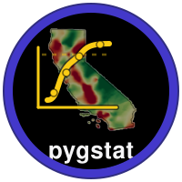

<p align="center">
  
</p>

<p align="center">
  <a href="https://pypi.org/project/pygstat/"></a>
  <a href="LICENSE.md"></a>
  <a href="https://pypi.org/project/pygstat/"></a>
</p>

**GPU-accelerated geostatistics for Python**, inspired by R's [`gstat`](https://cran.r-project.org/package=gstat) and GSLIB.

Fit variograms, interpolate with kriging, smooth areal rates with Poisson kriging, run sequential simulation, and map uncertainty — on **CPU or GPU**.

---

## Features

**Variograms**
- Models: spherical, exponential, Gaussian, Matérn, stable, cubic
- Estimators: Matheron, Cressie–Hawkins, Dowd
- Variogram cloud diagnostics
- Geometric anisotropy
- Space–time (metric) variogram models

**Kriging**
- Ordinary and simple kriging
- Universal kriging (polynomial drift)
- Cokriging with a linear model of coregionalization
- Indicator kriging and E-type / probability maps
- Disjunctive kriging (Matheron, 1976): a nonlinear estimator built from a Gaussian anamorphosis (reusing the normal-score transform) + Hermite polynomial expansion, kriging each Hermite order independently (via `SimpleKriging`, including GPU dispatch) under the bi-Gaussian model; produces both a point estimate and exceedance-probability maps at arbitrary cutoffs from the same kriged components
- Empirical Bayesian Kriging (Krivoruchko, 2012): propagates semivariogram-*parameter* uncertainty into the prediction, by simulating and refitting an ensemble of semivariograms (weighted by leave-one-out cross-validation consistency) and combining an `OrdinaryKriging`/`SimpleKriging` model per ensemble member — total predictive variance and probability maps then reflect both spatial-interpolation error and semivariogram-fitting error, unlike plain kriging's variance which only accounts for the former
- Soft (Markov-Bayes) indicator kriging: fuse sparse hard data with a dense, correlated soft-probability proxy (Zhu & Journel, 1993)
- Factorial Kriging Analysis: extract individual (short-range, long-range, nugget) structures of a nested variogram, or a denoised/noise-filtered map (Matheron, 1982)
- Regression kriging with a choice of trend models: linear, ensembles (random forest, gradient boosting, bagging, stacking), statistical (GAM via pyGAM, GLM, Bayesian ridge, quantile regression), H2O (AutoML, Deep Learning, DRF, GLM, GAM, GBM, XGBoost, Uplift DRF, Stacked Ensembles, with optional hyperparameter-grid tuning), PyTorch or TensorFlow MLPs (both with optional Optuna hyperparameter search), or Graph Neural Networks (plain spatial GNN, KCN, IGNNK)
- Spatio-temporal ordinary kriging (`STKriging`)
- Spatio-temporal Graph Neural Network regression kriging: `TGCN` (Zhao et al., 2019) and `DCRNN` (Li et al., 2018), for a fixed sensor network observed repeatedly over time
- Spatial-Temporal Graph Transformer Network regression kriging: `STTN` (Xu et al., 2020) and `GMAN` (Zheng et al., 2020), the attention-based counterpart to `TGCN`/`DCRNN`
- Convolutional LSTM regression kriging (`ConvLSTM`, Shi et al., 2015): a raster-based alternative that rasterizes the sensor network per time step instead of using a graph

**Areal / count data**
- Centroid-based Poisson kriging (Goovaerts, 2006)
- Area-to-area and area-to-point Poisson kriging
- Multivariate Poisson cokriging
- Spatio-temporal Poisson kriging for rate panels

**Simulation & GSLIB helpers**
- Sequential Gaussian Simulation (`sgsim`): GSLIB-style SGS with `nsim` realizations, optional normal-score transform (`itrans`), octant search, and ordinary/simple kriging at each node
- Sequential Indicator Simulation (`sisim`): GSLIB-style SIS for a continuous variable — per-threshold indicator kriging, order-relations correction, and CDF interpolation/tail models (linear, power, hyperbolic)
- 3-D kriging (`kt3d`): SK/OK/kriging-with-a-trend, point or block support, external drift, search-ellipsoid neighborhoods, leave-one-out cross-validation — a direct Python port of GSLIB's `kt3d.for`
- Geo-EAS I/O, normal-score and Box–Cox transforms, cell declustering, grid coordinates

**Validation & backends**
- Leave-one-out and k-fold cross-validation (including spatial CV helpers)
- GPU acceleration via CuPy for `Variogram` (empirical semivariogram), `OrdinaryKriging`, `SimpleKriging`, and `UniversalKriging` (covariance-matrix build + linear solve) — `use_gpu='auto'|True|False`, with automatic, verified (not just import-checked) CPU fallback; accepts NumPy, CuPy, or cuDF input
- The same `use_gpu` convention (default `'auto'`) is wired through `IndicatorKriging` (k-NN mode batches every prediction into one stacked solve), `Cokriging` / `MultivariateCokriging` / `ColocatedCokriging` / `CrossVariogram`, centroid `PoissonKriging` and `STPoissonKriging`, local `STKriging` / `krige_st`, `FactorialKriging`, `SoftKriging`, `DisjunctiveKriging`, `EmpiricalBayesianKriging`, `kt3d`, and residual ordinary kriging inside the regression-kriging backends
- `sgsim`/`sisim` accept `use_gpu` too, but default to `False` (not `'auto'`): nodes *within* one realization are sequential, so they cannot be batched. When `nsim >= 2` and GPU is on, independent realizations are stepped in lockstep and their local kriging systems are batched into one GPU solve per step — that is where GPU dispatch actually helps. For `nsim == 1`, pass `use_gpu=True` only if you use unusually large `num_points`
- Interoperable with GeoPandas, pandas, NumPy, and scikit-learn
- Kriging standard error and uncertainty maps

Heavy optional backends (H2O, PyTorch, TensorFlow) are imported lazily, so `import pygstat` still works if they are not installed.

---

## Python Package

| | |
|---|---|
| **Name** | `PyGStat` |
| **Version** | 0.1.0 |
| **PyPI** | [pypi.org/project/pygstat](https://pypi.org/project/pygstat/) |
| **Documentation** | [zia207.github.io/pygstat](https://zia207.github.io/pygstat/) |
| **Repository** | [github.com/zia207/pygstat](https://github.com/zia207/pygstat) |
| **License** | MIT |
| **Python** | ≥ 3.8 |
| **Author** | Zia Ahmed, Upatta Analytic |

**Optional extras:**

| Extra | Description |
|-------|-------------|
| `gpu` | CuPy (`cupy-cuda11x`) for GPU acceleration |
| `plot` | Matplotlib and contextily for mapping |
| `test` | pytest and pytest-cov |
| `h2o` | H2O regression kriging (AutoML, Deep Learning, DRF, GLM, GAM, GBM, XGBoost, Uplift DRF, Stacked Ensembles) |
| `pytorch` | Deep regression kriging (PyTorch), plus Graph Neural Network regression kriging (GNN/KCN/IGNNK), plus spatio-temporal GNN regression kriging (TGCN/DCRNN), plus spatio-temporal graph Transformer regression kriging (STTN/GMAN), plus Convolutional LSTM regression kriging (ConvLSTM) |
| `tensorflow` | Deep regression kriging (TensorFlow/Keras) |
| `gam` | pyGAM, for `RegressionKriging(regressor="gam")` |
| `optuna` | Optuna, for `DeepRegressionKriging(tune_hyperparameters=True)` |
| `deep` | `h2o` + `pytorch` + `tensorflow` |

For CUDA 12.x, install CuPy yourself (`pip install cupy-cuda12x`) rather than using the `gpu` extra.

---

## Project Layout

```
pygstat/
├── src/pygstat/        # Installed package
│   ├── core/           # Variogram models, empirical variograms, OK/SK
│   ├── io/             # GeoDataFrame helpers
│   └── utils/          # CPU/GPU backend and anisotropy
├── Tutorial/           # Workflow notebooks
├── tests/              # pytest suite and notebook tests
├── data/               # Sample datasets (Meuse, Jura, CA PM2.5, county rates, …)
├── examples/data/      # Extra spatial files used by some tutorials
├── scripts/            # Standalone utilities (plotting, Fortran readers, grid prediction)
├── Image/              # Figures used in docs and tutorials
└── pyproject.toml
```

Only `src/pygstat/` is built and published to PyPI. Tutorials, tests, and sample data stay in the repository.

---

## Installation

### From GitHub

Clone the repository and install in editable mode:

```bash
git clone https://github.com/zia207/pygstat.git
cd pygstat
python3 -m venv .venv
source .venv/bin/activate
pip install --upgrade pip
pip install -e .
# Optional: install extras
pip install -e ".[plot,test,gpu]"
```

### From PyPI

```bash
# Core
pip install pygstat

# Plotting
pip install pygstat[plot]

# GPU (CUDA 11.x extra)
pip install pygstat[gpu]

# GPU (CUDA 12.x) — install CuPy separately
pip install pygstat
pip install cupy-cuda12x

# Deep / AutoML backends
pip install pygstat[h2o]
pip install pygstat[pytorch]
pip install pygstat[tensorflow]
pip install pygstat[deep]          # all three
```

### From source (editable install)

```bash
cd /path/to/PyGStat

python3 -m venv .venv
source .venv/bin/activate          # Linux/macOS

pip install --upgrade pip
pip install -e .
pip install -e ".[plot,test]"      # optional extras
```

Confirm the install:

```bash
python3 -c "import pygstat; print(pygstat.__version__)"
```

---

## Quick Start

```python
import pandas as pd
import numpy as np
from pygstat import Variogram, OrdinaryKriging, loo_cv

df = pd.read_csv("data/meuse.csv")
coords = df[["x", "y"]].values
values = np.log(df["zinc"].values)

vg = Variogram(coords, values, model="spherical", estimator="matheron")
vg.fit()

ok = OrdinaryKriging(vg)
ok.fit(coords, values)

grid = pd.read_csv("data/meuse_grid.csv")
pred, se = ok.predict(grid[["x", "y"]].values, return_variance=True)

cv = loo_cv(ok, coords, values)
print(f"LOO RMSE: {cv['rmse']:.3f}, R²: {cv['r2']:.3f}")
```

From a GeoDataFrame:

```python
from pygstat import from_geodataframe, Variogram, OrdinaryKriging

coords, values = from_geodataframe(gdf, value_col="zinc")
vg = Variogram(coords, values, model="spherical")
vg.fit()
ok = OrdinaryKriging(vg).fit(coords, values)
```

**Regression Kriging with a choice of trend models** (see [src/pygstat/regression_kriging.py](src/pygstat/regression_kriging.py)):

```python
from pygstat import RegressionKriging, enforce_quantile_monotonicity

# regressor: 'linear' (default) | ensembles: 'random_forest', 'gradient_boosting',
# 'bagging', 'stacking' | statistical: 'gam' (needs pyGAM), 'glm', 'bayesian_ridge', 'quantile'
rk = RegressionKriging(regressor="stacking")
rk.fit(X_train, y_train, coords_train)
y_pred, y_std = rk.predict(X_test, coords_test, return_std=True)

rk_rf = RegressionKriging(regressor="random_forest", regressor_kwargs={"n_estimators": 500})
rk_rf.fit(X_train, y_train, coords_train)
rk_rf.feature_importances_  # available for tree-based ensembles

# an upper-bound (90th percentile) risk surface, instead of an average one
rk_p90 = RegressionKriging(regressor="quantile", regressor_kwargs={"quantile": 0.9})
rk_p90.fit(X_train, y_train, coords_train)
# fitting several quantile levels separately doesn't guarantee they stay ordered
# ("quantile crossing"); enforce_quantile_monotonicity(...) fixes that when it matters
```

**Regression Kriging with H2O** (see [src/pygstat/regression_kriging_h2o.py](src/pygstat/regression_kriging_h2o.py); needs `pip install pygstat[h2o]` and a Java runtime):

```python
from pygstat import RegressionKrigingH2O

# model_type: 'automl' (default) | 'deep_learning' | 'drf' | 'glm' | 'gam' | 'gbm' | 'xgboost'
# | 'uplift_drf' (needs treatment= in fit()) | 'stacked_ensemble'
rk = RegressionKrigingH2O(model_type="gbm", model_kwargs={"ntrees": 200})
rk.fit(X_train, y_train, coords_train)
y_pred = rk.predict(X_test, coords_test)

# hyperparameter-grid tuning for any non-AutoML model_type
rk_tuned = RegressionKrigingH2O(model_type="drf", tune_hyperparameters=True)
rk_tuned.fit(X_train, y_train, coords_train)
rk_tuned.get_best_model_metrics()
```

**Deep Regression Kriging with PyTorch** (see [src/pygstat/regression_kriging_pytorch_gpu.py](src/pygstat/regression_kriging_pytorch_gpu.py); needs `pip install pygstat[pytorch]`, GPU optional):

```python
from pygstat import DeepRegressionKriging

# Optuna hyperparameter search (needs `pip install pygstat[optuna]`): tunes hidden-layer
# sizes, dropout, learning rate, weight decay, and batch size by K-fold cross-validated
# RMSE, with median pruning of weak trials, then refits one model with the best found
rk = DeepRegressionKriging(tune_hyperparameters=True, n_trials=30, cv_folds=3, device="auto")
rk.fit(X_train, y_train, coords_train)
rk.best_params_       # the winning hyperparameters
rk.best_score_        # their cross-validated RMSE
y_pred = rk.predict(X_test, coords_test)
```

**Graph Neural Network Regression Kriging** (see [src/pygstat/regression_kriging_gnn.py](src/pygstat/regression_kriging_gnn.py); needs `pip install pygstat[pytorch]`; pure PyTorch, no `torch_geometric`):

```python
from pygstat import GNNRegressionKriging, KCN, IGNNK

# GNNRegressionKriging: plain spatial GNN (k-NN graph, covariates only)
# KCN: Kriging Convolutional Networks -- each node's own target is always
#      hidden from itself; neighbors' known targets are aggregated through a
#      learnable-lengthscale distance kernel (Appleby, Liu & Liu, 2020)
# IGNNK: Inductive GNN for Kriging -- trained by randomly masking nodes and
#        reconstructing them from the graph, so it generalizes to genuinely
#        new locations at prediction time (Wu, Cui, Nie & Wang, 2021)
rk = KCN(k_neighbors=12, hidden_dim=64, n_layers=2, device="auto")
rk.fit(X_train, y_train, coords_train)
y_pred, y_std = rk.predict(X_grid, coords_grid, return_std=True)
```

**Spatio-Temporal Graph Neural Network Regression Kriging** (see [src/pygstat/kriging_STGNN.py](src/pygstat/kriging_STGNN.py); needs `pip install pygstat[pytorch]`; pure PyTorch, no `torch_geometric`): a deep-learning counterpart to `STKriging` (space-time ordinary kriging, above) for a fixed sensor network observed repeatedly over time -- each time step's spatial k-NN graph convolution feeds a GRU-style temporal recurrence, then residuals are kriged spatially per time step and added back:

```python
from pygstat import TGCN, DCRNN

# TGCN: Temporal Graph Convolutional Network -- GRU gates built from a 1-hop
#       spatial graph convolution (Zhao, Song, Zhang, Liu, Wang & Li, 2019)
# DCRNN: Diffusion Convolutional Recurrent Neural Network -- GRU gates built
#        from a K-hop bidirectional diffusion convolution (Li, Yi, Shahabi &
#        Liu, 2018), a richer, direction-aware receptive field than TGCN's
rk = TGCN(k_neighbors=8, hidden_dim=32, device="cpu")
rk.fit(coords, values)              # values: (n_stations, n_time_steps), NaN allowed
pred = rk.predict(coords_grid)      # -> (n_grid, n_time_steps)
```

Tested on `data/CA_pm25_2025.csv` (163 California PM2.5 monitoring stations,
aggregated to monthly means) against `data/CA_pm25_grid_predictions.csv`,
the classical `STKriging` reference surface: on the same held-out-station
split, TGCN's RMSE (2.03 ug/m3) edges out classical space-time OK (2.24);
full-grid predictions correlate with the classical reference at r=0.66-0.99
per month (mean ~0.82-0.88) for both architectures.

**Spatial-Temporal Graph Transformer Network Regression Kriging** (see [src/pygstat/kriging_STGTN.py](src/pygstat/kriging_STGTN.py); needs `pip install pygstat[pytorch]`; pure PyTorch, no `torch_geometric`): the attention-based counterpart to `kriging_STGNN.py`'s recurrent GNNs above -- a **spatial attention** layer lets each node attend to its k-NN neighbors at every time step, and a **temporal attention** layer lets each node attend across its own time steps, injected with a sinusoidal positional encoding since attention has no inherent sense of order:

```python
from pygstat import STTN, GMAN

# STTN: Spatial-Temporal Transformer Network -- spatial and temporal
#       Transformer blocks applied one after another, each a standard
#       pre/post-norm residual + feed-forward sub-layer (Xu, Dai, Liu, Gao,
#       Lin, Qi & Xiong, 2020)
# GMAN: Graph Multi-Attention Network -- spatial and temporal attention
#       computed IN PARALLEL from the same input, then combined by a
#       learned gate rather than applied sequentially (Zheng, Fan, Wang &
#       Qi, 2020)
rk = STTN(k_neighbors=8, hidden_dim=32, n_heads=4, device="cpu")
rk.fit(coords, values)              # values: (n_stations, n_time_steps), NaN allowed
pred = rk.predict(coords_grid)      # -> (n_grid, n_time_steps)
```

Tested the same way as `kriging_STGNN.py`, on the same CA PM2.5 data: on
the held-out-station split, STTN's RMSE (2.10 ug/m3) and GMAN's (2.44) are
both competitive with classical space-time OK (2.24) and with TGCN/DCRNN;
full-grid predictions correlate with the classical reference at r=0.72-0.92
per month (mean ~0.83-0.85) for both architectures.

**Convolutional LSTM Regression Kriging** (see [src/pygstat/kriging_CNNLSTM.py](src/pygstat/kriging_CNNLSTM.py); needs `pip install pygstat[pytorch]`): a raster-based alternative to the graph-based modules above -- each time step's sensor observations are rasterized onto a small regular image, a [`ConvLSTM`](https://arxiv.org/abs/1506.04214) (Shi et al., 2015) processes the image sequence with 2-D convolutions replacing every LSTM gate's fully-connected transform, and predictions at arbitrary (non-pixel-center) coordinates are read back with bilinear interpolation:

```python
from pygstat import ConvLSTM

rk = ConvLSTM(grid_size=32, hidden_channels=16, device="cpu")
rk.fit(coords, values)              # values: (n_stations, n_time_steps), NaN allowed
pred = rk.predict(coords_grid)      # -> (n_grid, n_time_steps)
```

Tested the same way as `kriging_STGNN.py`/`kriging_STGTN.py`, on the same
CA PM2.5 data: on the held-out-station split, ConvLSTM's RMSE has come out
as low as 2.03 ug/m3 across runs (matching TGCN's almost exactly, since
neither this nor the sibling modules fix PyTorch's global weight-init RNG,
so exact numbers vary a little run to run); full-grid predictions
typically correlate with the classical reference at r~0.6-0.9 per month
(mean ~0.74-0.77) -- somewhat below the graph-based models' ~0.77-0.88, a
real and expected cost of rasterizing a sparse 163-station network onto a
coarse image before the CNN ever sees it.

**Deep Regression Kriging with TensorFlow/Keras** (see [src/pygstat/regression_kriging_tf.py](src/pygstat/regression_kriging_tf.py); needs `pip install pygstat[tensorflow]`):

```python
from pygstat import DeepRegressionKrigingTF

# Same Optuna tuning API as the PyTorch backend (needs `pip install pygstat[optuna]`)
rk = DeepRegressionKrigingTF(tune_hyperparameters=True, n_trials=30, cv_folds=3)
rk.fit(X_train, y_train, coords_train)
rk.best_params_
y_pred = rk.predict(X_test, coords_test)
```

**KT3D** (a direct port of GSLIB's `kt3d.for`, see [src/pygstat/kt3d.py](src/pygstat/kt3d.py)):

```python
import pandas as pd
from pygstat.common import read_gslib
from pygstat.nscore import nscore_forward, nscore_back
from pygstat.kt3d import kt3d_grid, kt3d_cross_validate

_, var_names, data = read_gslib("data/GSLIB_data/cluster.dat")
df = pd.DataFrame(data, columns=var_names)
ns, v_sorted, ns_sorted = nscore_forward(df["Primary"].values, tails="linear")
df["NS_Primary"] = ns

variogram = {"nugget": 0.1, "structures": [{"type": "spherical", "sill": 0.9, "range": 10.0}]}

result = kt3d_grid(
    df, x="Xlocation", y="Ylocation", value="NS_Primary", variogram=variogram,
    nx=50, xmn=0.5, xsiz=1.0, ny=50, ymn=0.5, ysiz=1.0,
    ktype="ordinary", search_radius=20.0, ndmin=1, ndmax=8,
)
result["estimate_raw"] = nscore_back(result["estimate"].values, v_sorted, ns_sorted)

cv = kt3d_cross_validate(
    df, x="Xlocation", y="Ylocation", value="NS_Primary", variogram=variogram,
    ktype="ordinary", search_radius=20.0, ndmin=1, ndmax=8,
)
print(cv[["true", "estimate", "error"]].describe())
```

`ktype` also supports `"simple"`, `"locally_varying_mean"` (external drift as a
locally-varying mean), and `"external_drift"` (external drift as a drift
term); pass `drift=(1,1,0,...)` for kriging-with-a-trend (KT), and
`block_size`/`block_discretization` for block kriging. See the module
docstring and [tests/test_kt3d_cluster.py](tests/test_kt3d_cluster.py) for
the full parameter reference and worked examples, or
[Tutorial/08_kriging_3d.ipynb](Tutorial/08_kriging_3d.ipynb) for the theory
walked through step by step with a full 3-D visualization.

**Sequential Gaussian Simulation** (see [src/pygstat/sgsim.py](src/pygstat/sgsim.py)
and [Tutorial/18_sgsim.ipynb](Tutorial/18_sgsim.ipynb)). `vario` uses GSLIB's
practical-range convention `[azimuth, nugget, major, minor, total_sill, vtype]`:

```python
from pygstat import sgsim

vario = [0, 0.05, 900.0, 900.0, float(np.var(np.log(df["zinc"]))), "exponential"]
sims = sgsim(
    grid[["x", "y"]].values, df, "x", "y", "zinc",
    num_points=16, vario=vario, radius=3000,
    kriging_type="ordinary", nsim=10, itrans=True, seed=42,
)
# sims.shape == (nsim, n_grid); E-type mean / P90:
etype, p90 = sims.mean(axis=0), np.percentile(sims, 90, axis=0)
```

**Sequential Indicator Simulation** (see [src/pygstat/sisim.py](src/pygstat/sisim.py)
and [Tutorial/19_sisim.ipynb](Tutorial/19_sisim.ipynb)). Indicators are
`I(Z <= threshold)`; pass one shared `vario` or a dict of per-threshold models:

```python
from pygstat import sisim

thresholds = np.percentile(df["zinc"], [10, 25, 50, 75, 90]).tolist()
global_cdf = [0.10, 0.25, 0.50, 0.75, 0.90]
vario = [0, 0.05, 800.0, 800.0, 0.25, "exponential"]  # or {t: vario_t, ...}
sims = sisim(
    grid[["x", "y"]].values, df, "x", "y", "zinc",
    thresholds, global_cdf, vario,
    num_points=16, radius=3000, kriging_type="ordinary", nsim=10, seed=42,
)
```

---

## Tutorials

Start with getting started, then pick a method. Each page is a workflow notebook.

### Core interpolation

| Notebook | Topic |
|----------|--------|
| [`Tutorial/00_getting_started.ipynb`](Tutorial/00_getting_started.ipynb) | Variograms, ordinary/simple kriging, cross-validation |
| [`Tutorial/01_variogram_modeling.ipynb`](Tutorial/01_variogram_modeling.ipynb) | Model choice, estimators, anisotropy |
| [`Tutorial/02_simple_kriging.ipynb`](Tutorial/02_simple_kriging.ipynb) | Known-mean interpolation |
| [`Tutorial/03_ordinary_kriging.ipynb`](Tutorial/03_ordinary_kriging.ipynb) | Unknown-mean interpolation |
| [`Tutorial/04_universal_kriging.ipynb`](Tutorial/04_universal_kriging.ipynb) | Polynomial drift |
| [`Tutorial/05_cokriging.ipynb`](Tutorial/05_cokriging.ipynb) | Linear model of coregionalization |
| [`Tutorial/08_kriging_3d.ipynb`](Tutorial/08_kriging_3d.ipynb) | GSLIB-style 3-D SK/OK/KT |

### Regression kriging

| Notebook | Topic |
|----------|--------|
| [`Tutorial/06_01_regression_kriging_scikit_learn.ipynb`](Tutorial/06_01_regression_kriging_scikit_learn.ipynb) | Linear, ensembles, GAM, GLM, quantile |
| [`Tutorial/06_02_regression_kriging_H20.ipynb`](Tutorial/06_02_regression_kriging_H20.ipynb) | AutoML, GBM, DRF, Deep Learning |
| [`Tutorial/06_03_regression_kriging_pytorch.ipynb`](Tutorial/06_03_regression_kriging_pytorch.ipynb) | Deep residual kriging (+ Optuna) |
| [`Tutorial/06_04_regression_krigingDNN_TF.ipynb`](Tutorial/06_04_regression_krigingDNN_TF.ipynb) | Keras MLP residual kriging |
| [`Tutorial/06_05_regression_kriging_gnn.ipynb`](Tutorial/06_05_regression_kriging_gnn.ipynb) | GNN, KCN, IGNNK |

### Indicators, structure, and space–time

| Notebook | Topic |
|----------|--------|
| [`Tutorial/07_indicator_kriging.ipynb`](Tutorial/07_indicator_kriging.ipynb) | Probability and E-type maps |
| [`Tutorial/10_disjunctive_kriging.ipynb`](Tutorial/10_disjunctive_kriging.ipynb) | Hermite-polynomial nonlinear estimator |
| [`Tutorial/11_empirical_bayesian_kriging.ipynb`](Tutorial/11_empirical_bayesian_kriging.ipynb) | Variogram-parameter uncertainty |
| [`Tutorial/09_soft_kriging.ipynb`](Tutorial/09_soft_kriging.ipynb) | Markov-Bayes hard + soft data |
| [`Tutorial/12_factorial_kriging.ipynb`](Tutorial/12_factorial_kriging.ipynb) | Nested structures / denoising |
| [`Tutorial/13_krigingST.ipynb`](Tutorial/13_krigingST.ipynb) | Metric space–time ordinary kriging |
| [`Tutorial/14_kriging_CNNLSTM.ipynb`](Tutorial/14_kriging_CNNLSTM.ipynb) | Raster ST residual kriging |
| [`Tutorial/15_kriging_STGNN.ipynb`](Tutorial/15_kriging_STGNN.ipynb) | Recurrent graph residual kriging |
| [`Tutorial/16_kriging_STGTN.ipynb`](Tutorial/16_kriging_STGTN.ipynb) | Attention-based graph residual kriging |

### Poisson kriging

| Notebook | Topic |
|----------|--------|
| [`Tutorial/17_01_poisson_Kriging_ata_atp.ipynb`](Tutorial/17_01_poisson_Kriging_ata_atp.ipynb) | Area-to-area / area-to-point Poisson kriging |
| [`Tutorial/17_02_poisson_cokriging.ipynb`](Tutorial/17_02_poisson_cokriging.ipynb) | Multivariate Poisson cokriging |
| [`Tutorial/17_03_poisson_kriging_ST.ipynb`](Tutorial/17_03_poisson_kriging_ST.ipynb) | Spatio-temporal Poisson kriging |

### Simulation

| Notebook | Topic |
|----------|--------|
| [`Tutorial/18_sgsim.ipynb`](Tutorial/18_sgsim.ipynb) | Sequential Gaussian Simulation |
| [`Tutorial/19_sisim.ipynb`](Tutorial/19_sisim.ipynb) | Sequential Indicator Simulation |

Additional notebook tests live under [`tests/`](tests/).

**Interactive widget:** [`docs/kriging-workbench.html`](docs/kriging-workbench.html) is a
self-contained, no-install browser demo (just open the file) built on the real Meuse river
floodplain dataset (155 soil samples, 3103-cell prediction grid). It's organized as a
five-tab dashboard mirroring a real analysis workflow: **Variable** (pick the metal, and for
cokriging its secondary variable/coverage), **Exploratory** (summary statistics, histogram,
spatial posting map and a trend-vs-distance scatter), **Variogram** (shape/range/nugget
sliders against the empirical semivariogram), **Kriging** (SK/OK/UK/RK/CK method choice,
prediction and uncertainty maps, hover-to-read local estimates) and **Probability**
(a user-set cutoff turned into a Gaussian exceedance-probability map from the kriged mean and
variance). A single **Run** button recomputes the kriging system on demand rather than on
every slider drag.

---

## GPU Setup (optional, Ubuntu + CUDA)

Skip this section for CPU-only use.

```bash
lsb_release -a
nvcc --version
```

### CUDA Toolkit 12.8 on Ubuntu 24.04

```bash
wget https://developer.download.nvidia.com/compute/cuda/repos/ubuntu2404/x86_64/cuda-ubuntu2404.pin
sudo mv cuda-ubuntu2404.pin /etc/apt/preferences.d/cuda-repository-pin-600
wget https://developer.download.nvidia.com/compute/cuda/12.8.0/local_installers/cuda-repo-ubuntu2404-12-8-local_12.8.0-570.86.10-1_amd64.deb
sudo dpkg -i cuda-repo-ubuntu2404-12-8-local_12.8.0-570.86.10-1_amd64.deb
sudo cp /var/cuda-repo-ubuntu2404-12-8-local/cuda-*-keyring.gpg /usr/share/keyrings/
sudo apt-get update
sudo apt-get -y install cuda-toolkit-12-8
```

```bash
echo 'export PATH=/usr/local/cuda-12.8/bin:$PATH' >> ~/.bashrc
echo 'export LD_LIBRARY_PATH=/usr/local/cuda-12.8/lib64:$LD_LIBRARY_PATH' >> ~/.bashrc
source ~/.bashrc
nvcc --version
```

### CuPy for CUDA 12.x

```bash
pip install cupy-cuda12x
```

### RAPIDS cuDF / cuML (optional)

```bash
pip install \
    --extra-index-url=https://pypi.nvidia.com \
    "cudf-cu12==25.10.*" "dask-cudf-cu12==25.10.*" "cuml-cu12==25.10.*" \
    "cugraph-cu12==25.10.*" "nx-cugraph-cu12==25.10.*" "cuxfilter-cu12==25.10.*" \
    "cucim-cu12==25.10.*" "pylibraft-cu12==25.10.*" "raft-dask-cu12==25.10.*" \
    "cuvs-cu12==25.10.*"
```

### Using GPU acceleration

`Variogram`, `OrdinaryKriging`, `SimpleKriging`, and `UniversalKriging` all
take a `use_gpu` argument:

```python
from pygstat import Variogram, OrdinaryKriging

v = Variogram(coords, values, model="spherical", use_gpu="auto")  # default
v.fit()  # empirical semivariogram computed on GPU if usable

ok = OrdinaryKriging(v, use_gpu="auto")
ok.fit(coords, values)
pred, std = ok.predict(coords_grid, return_variance=True)  # matrix build + solve on GPU if usable
```

- `use_gpu='auto'` (the default) uses the GPU only when CuPy is installed
  **and** can actually run a kernel on the attached GPU — checked once
  with a real op and cached, not just "did `import cupy` succeed." Older
  cards can import CuPy fine but fail at kernel-compile time for a newer
  CUDA toolkit; `'auto'` silently stays on CPU in that case rather than
  crashing.
- `use_gpu=True` forces GPU and warns (falling back to CPU) if it isn't
  actually usable; `use_gpu=False` always uses CPU (NumPy/SciPy).
- `X`/`X_pred` may be a NumPy array, a CuPy array, or a cuDF
  Series/DataFrame — predictions are always returned as NumPy.
- One exception: the Matérn model always evaluates on CPU internally
  (SciPy's Bessel functions have no CuPy equivalent), transferring data
  over and back transparently — correct either way, just not itself
  GPU-accelerated.

`IndicatorKriging` also takes `use_gpu` (default `'auto'`): its default
k-nearest-neighbor mode predicts every point independently, so all of them
batch into one stacked `xp.linalg.solve` call instead of a Python loop — a
real CPU speedup too, and what makes GPU dispatch worthwhile there.
(`search_radius` mode has variable neighbor counts per point, isn't
batchable the same way, and always runs on CPU.)

`sgsim`/`sisim` accept `use_gpu` as well, but default to **`False`**, not
`'auto'`. Nodes *within* one realization are sequential (each depends on
every previously-simulated node), so they cannot be batched the way
independent kriging predictions can:

- `nsim == 1`: one node at a time. For typical small `num_points`, GPU
  dispatch overhead usually outweighs the benefit — pass `use_gpu=True`
  only if you use unusually large neighborhoods.
- `nsim >= 2`: realizations are independent, so all `nsim` local kriging
  systems at each step are batched into one GPU solve. That is the useful
  GPU path for sequential simulation, and it scales with `nsim`.

`pygstat.cokriging`'s `CrossVariogram`, `Cokriging`, `MultivariateCokriging`,
and `ColocatedCokriging` also take `use_gpu` (default `'auto'`): `Cokriging`/
`MultivariateCokriging` build one big dense covariance matrix and solve it
in one call (`MultivariateCokriging` factors once at `fit()` and reuses it
across `predict()` calls, same as `ColocatedCokriging`'s primary system);
`ColocatedCokriging` additionally batches every prediction point's small
secondary (colocated) system into one stacked solve instead of a Python
loop, the same idea as `IndicatorKriging` above.


---

## Testing

```bash
pip install -e ".[test]"
pytest
```

---

## Related Projects

- [gstat](https://cran.r-project.org/package=gstat) — the R package this project is inspired by
- [GSLIB](http://www.gslib.com/) — sequential simulation and Geo-EAS conventions
- [GSTools](https://geostat-framework.readthedocs.io/projects/gstools/en/stable/) — another Python geostatistics toolbox
- [PyKrige](https://geostat-framework.readthedocs.io/projects/pykrige/) — kriging in Python

---

## License

MIT — see [LICENSE.md](LICENSE.md).

<p align="center">
  <br>
  Developed by<br>
  
</p>
